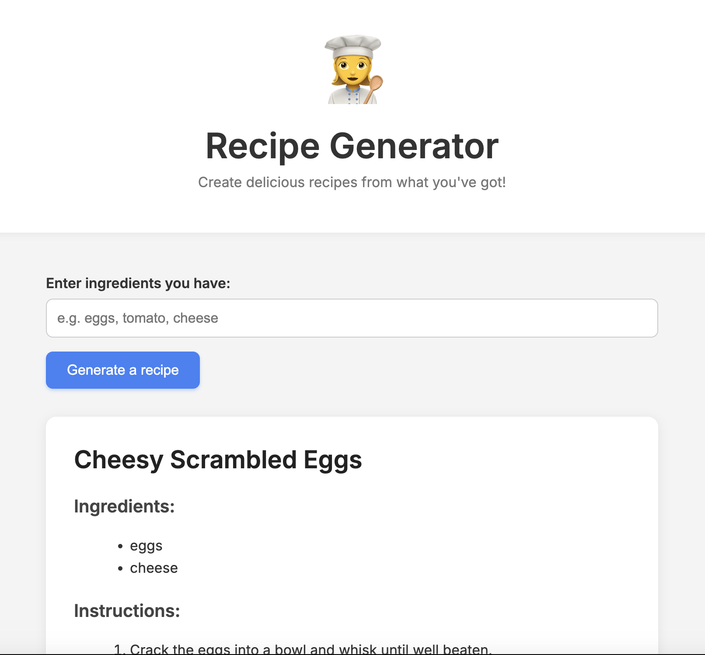

# Recipe Generator 🍳

AI-powered recipe suggestions based on what you have in your kitchen.

Built to test out OpenAI's GPT API calls within a webpage.

<p align="center">
  
</p>

---

## Live Demo

[](https://recipe-generator.vercel.app)

➡️ Try it live: **[recipe-generator.vercel.app](https://recipe-generator.vercel.app)**


---

## Running locally

1. Clone the repo
2. Install dependencies
3. Run the dev server

```bash
npm install
npm run dev
```

Visit `http://localhost:5173` in your browser.

---

## Environment Variable

To use the OpenAI API, create a `.env` file in the project root:

    VITE_OPENAI_API_KEY=your_openai_key_here

---

## Features

- Enter ingredients and get a full recipe (title, ingredients, steps)
- Clean, responsive layout with animated UI
- Fun waving chef emoji and cooking-themed loading spinner
- Fully client-side: no database or backend needed
- OpenAI integration with structured JSON output for clean rendering
- Deployed with continuous updates via Vercel and GitHub

---

## Tech Stack

- Vite
- OpenAI API
- Vanilla JS / HTML / CSS
- Deployed on Vercel

---

## License

MIT

