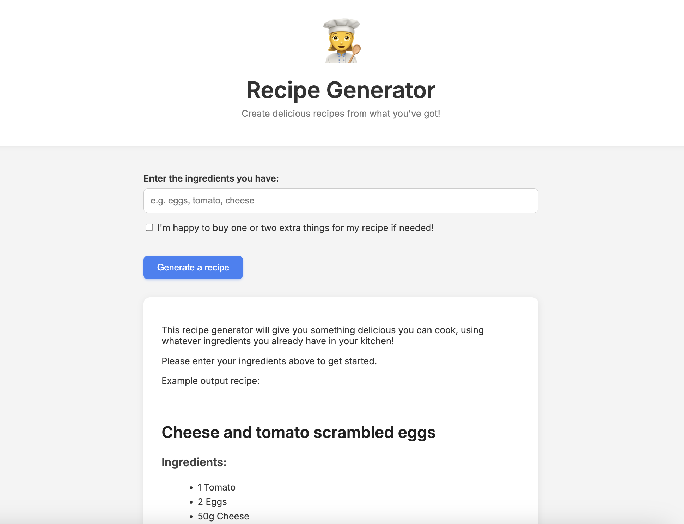

# recipe-generator
Powered by AI.

A quick app built to test out OpenAI's GPT API calls within a webpage.

---

Try it out locally:

1. Clone the repo
2. Install dependencies
3. Run the dev server

```bash
npm install
npm run dev
```

---

The app is pretty simplistic, it renders the OpenAI API response into a recipe format.

<p align="center">
  
</p>